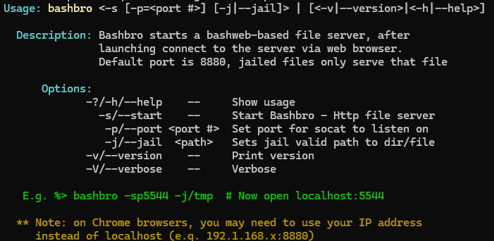

# bashbro
A Bash-based web file browser. Allowing you to browse, view and transfer files via your web browser.  

```
To start the bashbro server on port 5555: 
$> bashbro -s -p 5555

(-s start the bashbro server) 
(-p set the port number) 

To view a bashbro server on the default port 8880: 
open your web browser to localhost:8880
```

> [!TIP]
> *When using Chrome browser localhost may be blocked, in that case you can use your ip for instance 
> 192.168.1.55:8880 - no tickets on this plz, it's a Windows/Chrome thing.*
